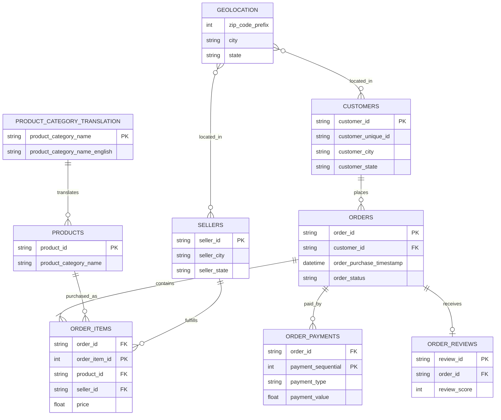

# Entity Relationship (ER) Diagram

## Overview

The Brazilian Olist E-Commerce Dataset is a relational database composed of multiple interconnected entities representing customers, orders, products, sellers, payments, reviews, and geographical information.

Understanding these relationships is essential for:

- Data integration
- SQL joins
- Python data merging
- Customer-level feature engineering
- Churn prediction
- Business Intelligence reporting

This document provides a high-level Entity Relationship (ER) model of the dataset.

---

# Entity Relationship Diagram

---

# Relationship Explanation

## Customers → Orders

Each customer can place multiple orders throughout their lifetime.

This relationship enables customer behaviour analysis including:

- Recency
- Frequency
- Total Orders
- Customer Lifetime Value (Proxy)

---

## Orders → Order Items

Each order may contain multiple products.

This relationship enables:

- Basket Analysis
- Product Diversity
- Revenue Calculation

---

## Products → Order Items

A single product may appear in many customer orders.

This relationship helps identify:

- Popular Products
- Customer Preferences
- Category Behaviour

---

## Sellers → Order Items

One seller can fulfill many products purchased by different customers.

Seller information supports marketplace performance analysis.

---

## Orders → Payments

An order can contain one or multiple payment records.

This allows analysis of:

- Payment Methods
- Installments
- Spending Behaviour

---

## Orders → Reviews

Customers generally submit one review per completed order.

Review data is valuable for measuring customer satisfaction and engineering predictive features.

---

## Products → Category Translation

Product categories are stored in Portuguese.

The translation table maps these values into English, improving reporting and visualization.

---

## Geolocation

The geolocation table provides location mapping using ZIP code prefixes.

Although not directly required for churn prediction, it supports:

- Regional Analysis
- Geographic Segmentation
- State-Level Business Insights

---

# Why the ER Diagram Matters

The ER model provides a blueprint for integrating multiple datasets into a single customer-level analytical dataset.

It ensures:

- Correct SQL joins
- Accurate Python merges
- Proper aggregation
- Reduced duplication
- Reliable feature engineering

Without understanding entity relationships, analysts risk introducing duplicate records, inaccurate metrics, and unreliable machine learning models.

---

# Business Importance

The Entity Relationship model serves as the architectural foundation of the entire Customer Retention Intelligence Platform.

Every future phase—including Data Cleaning, Customer-Level Data Mart creation, Feature Engineering, Machine Learning, and Business Intelligence dashboards—will rely on these documented relationships.